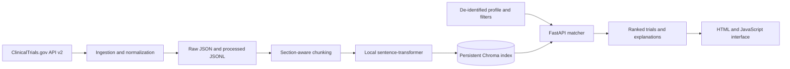

# Clinical Trial Matching Engine

I built this project to demonstrate how a production-style retrieval pipeline can combine semantic search with explicit eligibility filters. It downloads public, de-identified study metadata from the ClinicalTrials.gov API v2, converts trial content into local embeddings, stores those vectors in Chroma, and ranks trials against a natural-language profile.

The system uses no paid model API. Embeddings run locally with `sentence-transformers/all-MiniLM-L6-v2`, and match explanations are generated deterministically from the evidence and filters used during retrieval.

> **Important:** This is a research and portfolio tool, not a certified medical matching system or medical device. It must not be used for diagnosis, treatment, enrollment decisions, or other clinical decisions. Study eligibility must always be confirmed by qualified clinicians and the trial team. Do not enter identifiable patient information.

## What it does

- Pulls current public studies from ClinicalTrials.gov API v2
- Parses summaries, conditions, interventions, eligibility criteria, age ranges, sex, status, and locations
- Chunks and embeds high-value trial text locally
- Stores vectors in a persistent, file-based Chroma collection
- Combines semantic relevance with age, condition, location, sex, and recruitment-status filters
- Returns ranked trials with transparent match explanations and source links
- Exposes FastAPI endpoints and a responsive browser interface

## Architecture



The retriever over-fetches semantically relevant chunks, aggregates them by NCT ID, applies strict structured filters, and calculates a final score from 78% semantic relevance and 22% structured alignment. This keeps the retrieval behavior inspectable while allowing natural-language queries.

## Project structure

```text
app/                    FastAPI application and static frontend
app/services/           ingestion, embeddings, Chroma, and matching logic
scripts/                repeatable data-refresh command
tests/                  unit and API tests with a realistic API fixture
data/raw/               timestamped ClinicalTrials.gov responses
data/processed/         normalized JSONL trial records
data/chroma/            persistent vector database
```

## Local setup

Python 3.11 or 3.12 is recommended.

```bash
git clone https://github.com/sattipraveena3-sudo/clinical-trial-matching-engine.git
cd clinical-trial-matching-engine
python -m venv .venv
source .venv/bin/activate        # Windows: .venv\Scripts\activate
pip install -r requirements.txt
cp .env.example .env            # Windows PowerShell: Copy-Item .env.example .env
python scripts/refresh_trials.py --max-studies 1000
uvicorn app.main:app --reload
```

Open `http://localhost:8000`. API documentation is available at `http://localhost:8000/docs`.

The first refresh downloads the embedding model and may take several minutes. To run a small smoke test, use `--max-studies 50`.

## Docker

```bash
cp .env.example .env
docker compose --profile tools run --rm refresh
docker compose up --build
```

The `data` directory and Hugging Face model cache are persisted across container restarts.

## API

### `POST /match`

```bash
curl -X POST http://localhost:8000/match \
  -H "Content-Type: application/json" \
  -d '{
    "query": "55 year old female with type 2 diabetes seeking cardiology trials near Texas",
    "age": 55,
    "condition": "Type 2 Diabetes",
    "location": "Texas",
    "recruitment_status": ["RECRUITING"],
    "sex": "FEMALE",
    "top_k": 10
  }'
```

### `GET /trial/{nct_id}`

Returns the normalized local record for one indexed trial.

### `GET /health`

Returns service health, embedding model, and indexed chunk count.

## Tests

```bash
pytest
```

The suite covers API pagination and parsing, age normalization, section-aware chunking, embedding output, health checks, ranked match responses, trial lookup, and missing-trial behavior. Tests use synthetic study metadata and never download a model.

## Refreshing data periodically

Run the refresh script manually or schedule it with cron, GitHub Actions, EventBridge, or another scheduler:

```bash
python scripts/refresh_trials.py --max-studies 5000
```

Example weekly cron entry:

```cron
0 3 * * 0 cd /path/to/clinical-trial-matching-engine && .venv/bin/python scripts/refresh_trials.py --max-studies 5000
```

## Known limitations

- Semantic relevance does not establish clinical eligibility.
- Eligibility criteria are mostly free text and may contain complex temporal or laboratory constraints.
- Location matching is substring-based rather than distance-based.
- The local index reflects the most recent successful refresh, not necessarily the live registry at query time.
- Deterministic explanations summarize retrieval evidence; they are not clinical reasoning.
- The default MiniLM model is efficient but not specialized for biomedical retrieval.
- Rebuilding the collection is simple and reliable for a portfolio-scale index but not optimized for millions of chunks.

## What I would improve next

I would add a biomedical embedding benchmark, geospatial radius search, incremental Chroma updates, structured extraction of inclusion and exclusion rules, explicit contradiction detection, reranking with a local cross-encoder, retrieval evaluation using clinician-labeled relevance judgments, authentication and rate limiting, audit logging, and scheduled cloud deployment. Before any clinical use, I would also require privacy review, prospective validation, bias analysis, human-factors testing, and regulatory assessment.

## Suggested incremental commits

1. `set up project scaffolding and configuration`
2. `add ClinicalTrials.gov v2 ingestion client`
3. `normalize trial eligibility and location metadata`
4. `add section-aware trial text chunking`
5. `integrate local sentence-transformer embeddings`
6. `add persistent Chroma vector store`
7. `implement hybrid trial matching and explanations`
8. `add FastAPI health match and trial endpoints`
9. `build responsive trial search frontend`
10. `add ingestion embedding and API tests`
11. `add Docker Compose and refresh workflow`
12. `document architecture setup and limitations`

## Progressive Git and GitHub CLI workflow

The repository is already published, but this is the exact workflow I would use to recreate a gradual history locally. Stage only the files named for each step rather than using `git add .`.

```bash
mkdir clinical-trial-matching-engine && cd clinical-trial-matching-engine
git init -b main

# After creating config and scaffolding
git add app/__init__.py app/config.py app/models.py pyproject.toml .env.example .gitignore data
git commit -m "set up project scaffolding and configuration"

# After adding ingestion
git add app/services/clinical_trials.py scripts/refresh_trials.py
git commit -m "add ClinicalTrials.gov v2 ingestion client"

# Commit refinements to normalization separately
git add app/services/clinical_trials.py app/models.py
git commit -m "normalize trial eligibility and location metadata"

# Retrieval pipeline commits
git add app/services/embeddings.py
git commit -m "add section-aware trial text chunking"
git add requirements.txt app/services/embeddings.py
git commit -m "integrate local sentence-transformer embeddings"
git add app/services/vector_store.py
git commit -m "add persistent Chroma vector store"
git add app/services/matcher.py
git commit -m "implement hybrid trial matching and explanations"

# API and UI
git add app/main.py
git commit -m "add FastAPI health match and trial endpoints"
git add app/static
git commit -m "build responsive trial search frontend"

# Tests and delivery
git add tests
git commit -m "add ingestion embedding and API tests"
git add Dockerfile docker-compose.yml Makefile
git commit -m "add Docker Compose and refresh workflow"
git add README.md
git commit -m "document architecture setup and limitations"

# Create and connect the public GitHub repository
gh auth login
gh repo create clinical-trial-matching-engine --public --source=. --remote=origin
git push -u origin main
```

If the remote repository already exists, connect it with:

```bash
git remote add origin https://github.com/sattipraveena3-sudo/clinical-trial-matching-engine.git
git push -u origin main
```

## License

MIT
